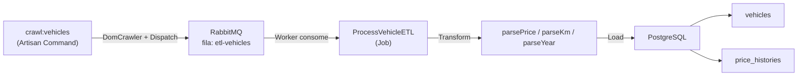

# Vehicle Crawler ETL — Walkthrough

## Resumo

Projeto Laravel para Web Crawling + ETL de anúncios de veículos seminovos. O sistema extrai dados brutos de HTML, envia para uma fila RabbitMQ, e um Worker processa a limpeza/transformação dos dados antes de persistir em PostgreSQL.

## Arquitetura



## Arquivos Criados/Modificados

### Infraestrutura

| Arquivo | Descrição |
|---------|-----------|
| [Dockerfile](file:///home/raulntjj/Repositories/web-crawlers/Dockerfile) | PHP 8.4-cli-alpine com extensões pdo_pgsql, sockets, bcmath, pcntl |
| [docker-compose.yml](file:///home/raulntjj/Repositories/web-crawlers/docker-compose.yml) | 4 serviços: crawler, worker, rabbitmq, postgres |
| [.env](file:///home/raulntjj/Repositories/web-crawlers/.env) | Variáveis para PostgreSQL e RabbitMQ |
| [.dockerignore](file:///home/raulntjj/Repositories/web-crawlers/.dockerignore) | Exclusões do contexto de build |

### Configuração

| Arquivo | Alteração |
|---------|-----------|
| [config/queue.php](file:///home/raulntjj/Repositories/web-crawlers/config/queue.php) | Conexão `rabbitmq` adicionada ao array de connections |

### Banco de Dados

| Arquivo | Descrição |
|---------|-----------|
| [create_vehicles_table](file:///home/raulntjj/Repositories/web-crawlers/database/migrations/2026_06_15_000001_create_vehicles_table.php) | Tabela vehicles com external_id único, price decimal, km int, anos separados |
| [create_price_histories_table](file:///home/raulntjj/Repositories/web-crawlers/database/migrations/2026_06_15_000002_create_price_histories_table.php) | Tabela price_histories com FK para vehicles, apenas created_at |

### Models

| Arquivo | Descrição |
|---------|-----------|
| [Vehicle.php](file:///home/raulntjj/Repositories/web-crawlers/app/Models/Vehicle.php) | Model com $fillable, casts tipados, hasMany PriceHistory |
| [PriceHistory.php](file:///home/raulntjj/Repositories/web-crawlers/app/Models/PriceHistory.php) | Model imutável (UPDATED_AT = null), belongsTo Vehicle |

### ETL Pipeline

| Arquivo | Etapa | Descrição |
|---------|-------|-----------|
| [CrawlVehiclesCommand.php](file:///home/raulntjj/Repositories/web-crawlers/app/Console/Commands/CrawlVehiclesCommand.php) | EXTRACT | Parseia HTML fictício com Symfony DomCrawler, extrai dados brutos e despacha Jobs |
| [ProcessVehicleETL.php](file:///home/raulntjj/Repositories/web-crawlers/app/Jobs/ProcessVehicleETL.php) | TRANSFORM & LOAD | Limpa dados (parsePrice, parseKm, parseYear), updateOrCreate + histórico de preços |

## Operação

### Iniciar a infraestrutura
```bash
docker compose up -d --build
docker compose exec crawler php artisan migrate --force
```

### Executar o crawler
```bash
docker compose exec crawler php artisan crawl:vehicles
```

### Verificar dados
```bash
docker compose exec crawler php artisan tinker --execute="App\Models\Vehicle::all()"
```

### Monitorar o RabbitMQ
Acessar http://localhost:15672 (guest/guest)

---

## Verificação

### Resultados do Teste

| Veículo | Preço Bruto → Limpo | KM Bruto → Limpo | Ano Bruto → Limpo |
|---------|---------------------|-------------------|--------------------|
| Honda City Hatch EXL | `R$ 95.900,00` → `95900.00` | `24.500 km` → `24500` | `2022/2023` → `2022/2023` |
| Toyota Corolla Cross XRE | `R$ 179.990,00` → `179990.00` | `8.320 km` → `8320` | `2023/2024` → `2023/2024` |
| VW Polo Highline 200 TSI | `R$   89.500,00` → `89500.00` | `45.230 km` → `45230` | `2021/2022` → `2021/2022` |
| Hyundai HB20 Platinum Plus | `R$98.750,50` → `98750.50` | `12.100km` → `12100` | `2023/2023` → `2023/2023` |
| Chevrolet Tracker Premier | `R$ 142.000,00` → `142000.00` | `31.800 km` → `31800` | `2022/2023` → `2022/2023` |

- ✅ 5 veículos criados no banco
- ✅ 5 registros de histórico de preços
- ✅ Todos os dados transformados corretamente
- ✅ Pipeline completo: Extract → Queue → Transform → Load

> [!NOTE]
> O Dockerfile foi atualizado para **PHP 8.4** porque o Laravel 13 + Symfony 8.1 utilizam **property hooks** (feature do PHP 8.4+) no `Request.php`.
